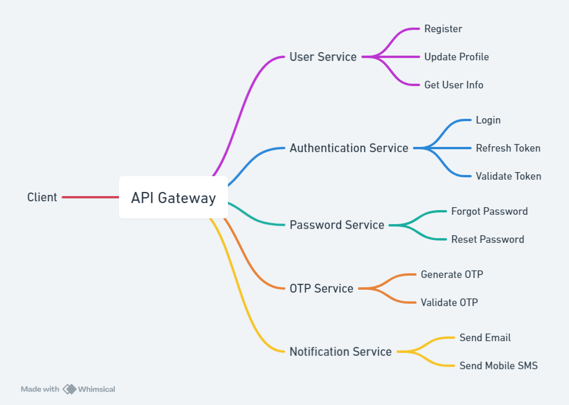

# User Management System

This project demonstrates a microservice architecture designed to manage user registration, authentication, password management, and communication through a notification service that includes email and SMS features for sending OTPs and other information to users. The system uses an API Gateway for routing client requests to the respective services.

## Architecture Overview



The system is structured into multiple microservices, each handling specific functionalities. The core components of the architecture are:

### 1. API Gateway
The **API Gateway** acts as the entry point for all requests. It routes client requests to the appropriate microservice based on the request type:
- Routes requests to other services.
- Validates tokens via the **Authentication Service** (Private API).

### 2. User Service
The **User Service** manages user-related operations:
- `Register`: Allows new user registration.
- `Update Profile`: Enables users to update their profile information.
- `Get User Info`: Retrieves user information for authenticated users.

### 3. Authentication Service
The **Authentication Service** is responsible for handling:
- `Login`: Authenticates a user with credentials.
- `Refresh Token`: Provides a new JWT token to extend the session.
- `Validate Token`: Verifies token authenticity for secure endpoints.

### 4. Password Service
The **Password Service** provides functionality for password recovery and reset:
- `Forgot Password`: Initiates password recovery through email/SMS.
- `Reset Password`: Allows the user to set a new password.

### 5. OTP Service
The **OTP Service** generates and validates one-time passwords (OTPs) for secure transactions:
- `Generate OTP`: Issues a new OTP for verification.
- `Validate OTP`: Confirms the OTP provided by the user.

### 6. Notification Service
The **Notification Service** handles notifications and alerts:
- `Send Email`: Sends emails to the user for account-related notifications.
- `Send Mobile SMS`: Sends SMS messages to the user's phone for critical alerts like OTPs.

### 7. Token Validation
A **Private API** is used to validate tokens securely. This ensures that only authenticated users can access specific services.

---

## Communication Flow

### 1. Client-Server Communication (REST API)
- **Clients** (web or mobile apps) communicate with the system through the **API Gateway** via RESTful APIs.
- The API Gateway acts as the main entry point, ensuring all requests are authenticated and routed to the relevant microservices.

### 2. Service-to-Service Communication (gRPC)
- Once a request reaches the **API Gateway**, it is forwarded to the corresponding microservices via **gRPC**. This high-performance communication protocol allows the services to efficiently handle interactions between themselves.
  
Each microservice communicates with others using gRPC for internal service communication:
- The **User Service**, **Authentication Service**, **Password Service**, **OTP Service**, and **Notification Service** interact with each other for tasks such as user existence checks, sending OTPs, and validating tokens.

---

## Interaction Flow

1. The **Client** sends requests to the **API Gateway**.
2. Based on the request type (e.g., registration, login, profile update, password reset), the **API Gateway** forwards the request to the appropriate microservice.
3. For operations requiring authentication, the **API Gateway** validates the token via the **Authentication Service**.
4. Services communicate with each other using gRPC for secure and fast interaction.

---

## Key Features

- **JWT-based Authentication**: Secure login and token-based session management.
- **gRPC Communication**: High-performance inter-service communication.
- **REST API**: Client-server communication using REST APIs.
- **OTP-based Security**: Secure sensitive operations with one-time passwords.
- **Notification Service**: Email and SMS integration for user notifications.

## Technologies Used

- **Spring Boot**: To build each microservice.
- **gRPC**: For internal service-to-service communication.
- **JWT**: For authentication and session management.
- **REST APIs**: For client-server communication.
- **SMTP and SMS Gateway**: To send email and SMS notifications.
- **Docker/Kubernetes**: (Optional) For containerization and orchestration.

## Getting Started

1. Clone the repository:
    ```bash
    git clone https://github.com/ayeujjawalsingh/User-Management-System.git
    ```

2. Build and run the services:
    ```bash
    cd user-management-system
    mvn clean install
    docker-compose up -d
    ```

3. Access the services via the API Gateway:
    - Register: `POST /user/register`
    - Update Profile: `PUT /user/update-profile`
    - Get  User Info: `GET /user/get-user-info`
    - Login: `POST /auth/login`
    - Validate Token: `POST /auth/validate-token`
    - Refresh Token: `POST /auth/refresh-token`
    - Forgot Password: `POST /password/forgot-password`
    - Reset Password: `POST /password/reset-password`
    - Generate OTP: `POST /otp/generate-otp`
    - Validate OTP: `POST /otp/validate-otp`
    - Send Email: `POST /notif/send-email`
    - Send SMS: `POST /notif/send-sms`
<!-- 
## License

This project is licensed under the MIT License.
 -->
